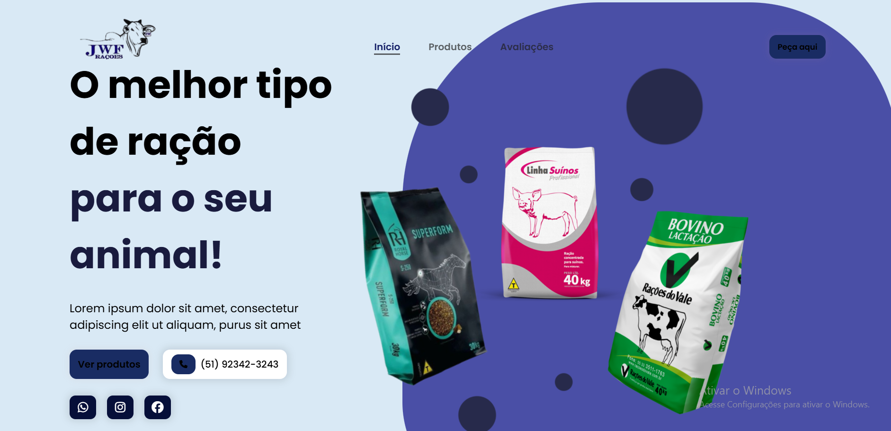
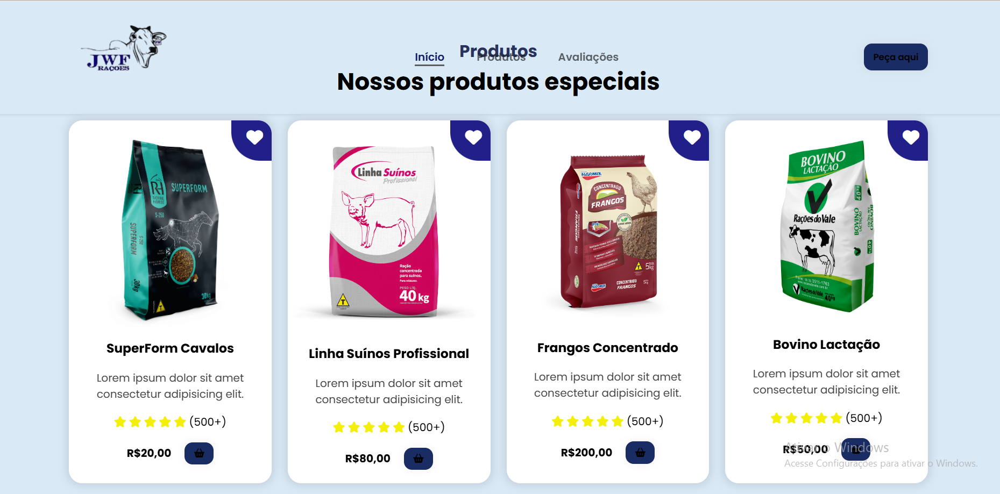
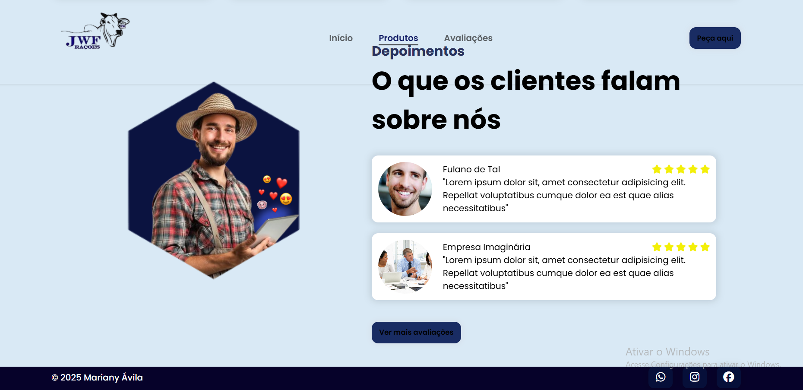

# ˚ ༘ ೀ⋆｡🌾 JWF Rações - Landing Page

Landing page desenvolvida para a empresa **JWF Rações**, especializada em nutrição animal de grande porte. O site apresenta os principais produtos, depoimentos de clientes e um layout moderno e responsivo.

## ˙✧˖°📷 ༘ ⋆｡˚ Preview

### ₊⊹ Página Inicial

### ₊⊹ Produtos

### ₊⊹ Avaliações

## ⋆.˚🦋༘⋆ Tecnologias Utilizadas

- HTML5
- CSS3
- JavaScript
- Font Awesome (ícones)
- jQuery
- ScrollReveal.js

## ⋆⭒˚.⋆🪐 ⋆ Funcionalidades

- ✅ Layout responsivo
- ✅ Menu mobile com botão hamburguer
- ✅ Botões de contato e redes sociais
- ✅ Sessão com produtos destacados
- ✅ Avaliações de clientes

## ୧ ‧₊˚ 🍮 ⋅ ☆ Autora

Feito com 💛 por **Mariany Ávila**  

## ๋ ࣭ ⭑📌 Status do Projeto

๋ ࣭ ⭑🚧 Projeto em desenvolvimento — melhorias futuras serão aplicadas como:

- Integração com sistema de pedidos real
- Área administrativa para novos produtos
- Otimização de performance

---
